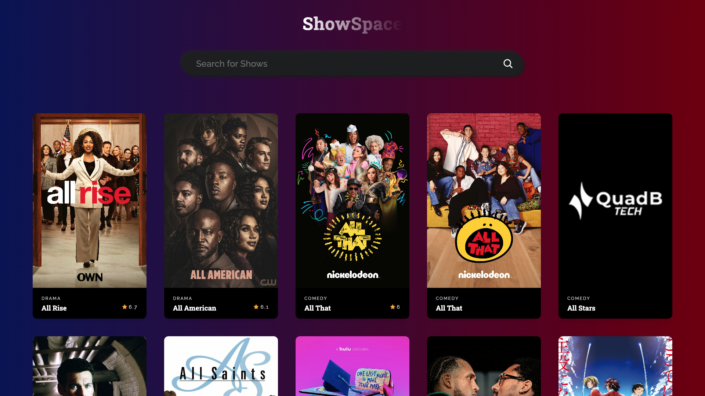
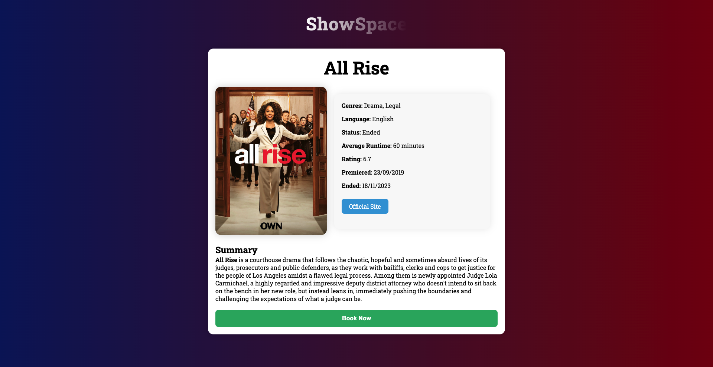

# TV Shows App using React JS

ShowSpace is a simple React application that allows users to browse TV shows and view details about each show. The app utilizes the TVMaze API for fetching show data.

Deployed Link: https://tvshowsappreact.vercel.app/

## Features

- **Show List:** View a list of TV shows with basic information.
- **Show Details:** Click on a show to see more details, including a summary.
- **Booking Form:** Book tickets for a show with a simple form.

## Screens

### Show List

- Displays a list of TV shows.
- Allows searching for shows by name.
- Clicking on a show redirects to its details page.

### Show Details

- Shows detailed information about a specific TV show.
- Includes a booking form to book tickets for the show.

### Booking Form

- Form to enter name and email for booking tickets.
- Data is stored in local storage and pre-filled if available.

## Components Structure

- **App:** Main component rendering the app layout.
- **ShowList:** Component for displaying the list of TV shows.
- **ShowCard:** Component representing a single show card.
- **ShowDetails:** Component for displaying detailed information about a specific show.
- **BookingForm:** Component for the booking form.

## Local Storage

- User details entered in the booking form are stored in local storage.
- Data is retrieved and pre-filled when the form is opened again.

## Setup

1. Clone the repository.
2. Run `npm install` to install dependencies.
3. Run `npm run dev` to start the development server.
4. Open the app in your browser at `http://localhost:5173`.

## Technologies Used

- React
- Axios for API requests
- CSS for styling

## Author

Robin Singh

